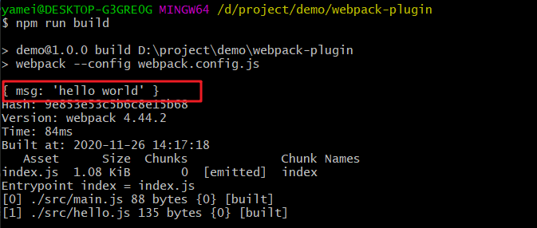
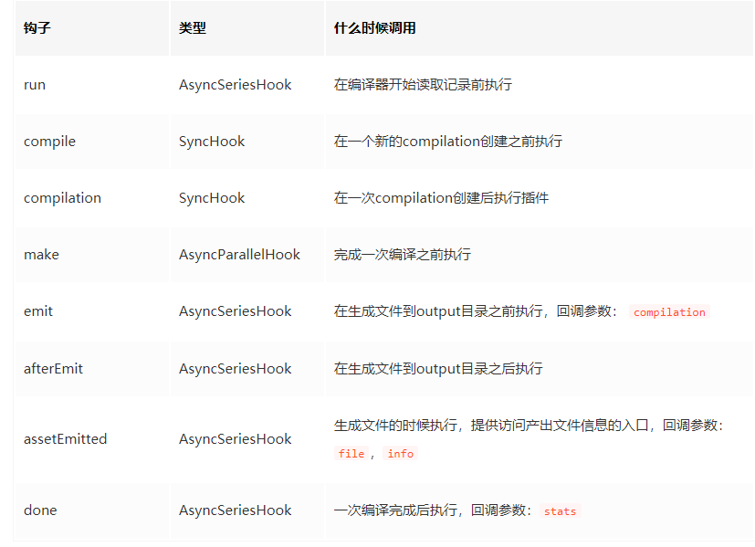
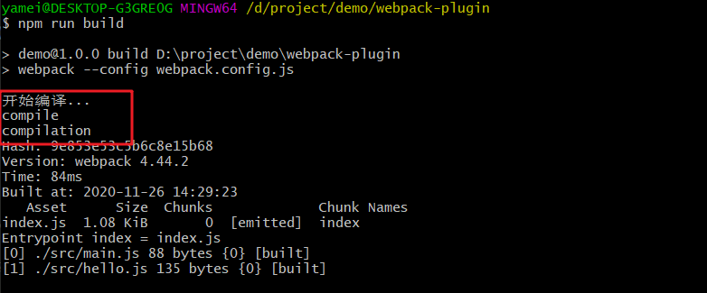
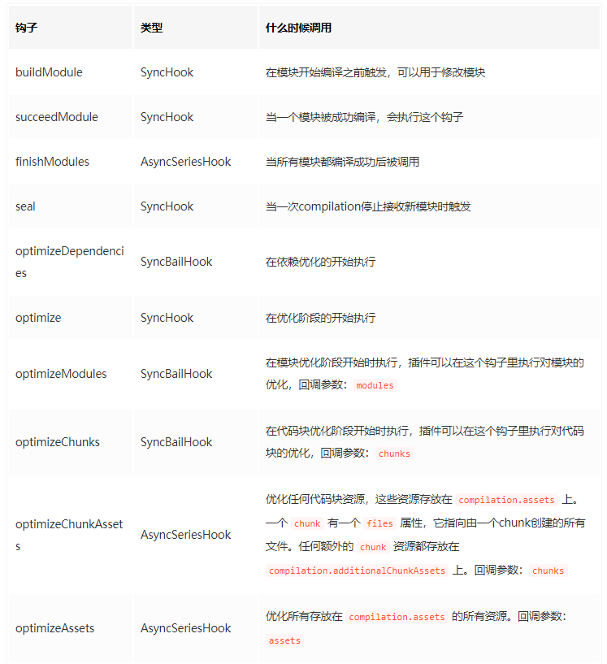

# webpack 插件原理

webpack 插件的特征

- 是一个独立的模块。
- 模块对外暴露一个 js 函数。
- 函数的原型 (prototype) 上定义了一个注入 compiler 对象的 apply 方法。
- apply 函数中需要有通过 compiler 对象挂载的 webpack 事件钩子，钩子的回调中能拿到当前编译的 compilation 对象，如果是异步编译插件的话可以拿到回 调 callback。
- 完成自定义子编译流程并处理 complition 对象的内部数据。
- 如果异步编译插件的话，数据处理完成后执行 callback 回调。

```js
class HelloPlugin {
  // 在构造函数中获取用户给该插件传入的配置
  constructor(options) {}
  // Webpack 会调用 HelloPlugin 实例的 apply 方法给插件实例传入 compiler 对象
  apply(compiler) {
    // 在emit阶段插入钩子函数，用于特定时机处理额外的逻辑；
    compiler.hooks.emit.tap('HelloPlugin', (compilation) => {
      // 在功能流程完成后可以调用 webpack 提供的回调函数；
    })
    // 如果事件是异步的，会带两个参数，第二个参数为回调函数，
    // 在插件处理完任务时需要调用回调函数通知webpack，才会进入下一个处理流程。
    compiler.plugin('emit', function (compilation, callback) {
      // 支持处理逻辑
      // 处理完毕后执行 callback 以通知 Webpack
      // 如果不执行 callback，运行流程将会一直卡在这不往下执行
      callback()
    })
  }
}

module.exports = HelloPlugin
```

1. 读取配置的过程中会先执行 new HelloPlugin(options) 初始化一个 HelloPlugin 获得其实例。
2. 初始化 compiler 对象后调用 HelloPlugin.apply(compiler) 给插件实例传入 compiler 对象。
3. 插件实例在获取到 compiler 对象后，就可以通过 compiler.plugin(事件名称, 回调函数) 监听到 Webpack 广播出来的事件。 并且可以通过 compiler 对象去操作 Webpack。

### 事件流机制

webpack 本质上是一种事件流的机制，它的工作流程就是将各个插件串联起来，而实现这一切的核心就是 Tapable。

Webpack 的 Tapable 事件流机制保证了插件的有序性，将各个插件串联起来， Webpack 在运行过程中会广播事件，插件只需要监听它所关心的事件，就能加入到这条 webapck 机制中，去改变 webapck 的运作，使得整个系统扩展性良好。

Tapable 也是一个小型的 library，是 Webpack 的一个核心工具。类似于 node 中的 events 库，核心原理就是一个`订阅发布模式`。作用是提供类似的插件接口。方法如下：

```js
//  广播事件
compiler.apply('event-name', params)
compilation.apply('event-name', params)

// 监听事件
compiler.plugin('event-name', function (params) {})
compilation.plugin('event-name', function (params) {})
```

我们来看下 Tapable

```js
function Tapable() {
  this._plugins = {}
}
//发布name消息
Tapable.prototype.applyPlugins = function applyPlugins(name) {
  if (!this._plugins[name]) return
  var args = Array.prototype.slice.call(arguments, 1)
  var plugins = this._plugins[name]
  for (var i = 0; i < plugins.length; i++) {
    plugins[i].apply(this, args)
  }
}
// fn订阅name消息
Tapable.prototype.plugin = function plugin(name, fn) {
  if (!this._plugins[name]) {
    this._plugins[name] = [fn]
  } else {
    this._plugins[name].push(fn)
  }
}
//给定一个插件数组，对其中的每一个插件调用插件自身的apply方法注册插件
Tapable.prototype.apply = function apply() {
  for (var i = 0; i < arguments.length; i++) {
    arguments[i].apply(this)
  }
}
```

Tapable 为 webpack 提供了统一的插件接口（钩子）类型定义，它是 webpack 的核心功能库。webpack 中目前有十种 hooks，在 Tapable 源码中可以看到，他们是：

```js
exports.SyncHook = require('./SyncHook')
exports.SyncBailHook = require('./SyncBailHook')
exports.SyncWaterfallHook = require('./SyncWaterfallHook')
exports.SyncLoopHook = require('./SyncLoopHook')
exports.AsyncParallelHook = require('./AsyncParallelHook')
exports.AsyncParallelBailHook = require('./AsyncParallelBailHook')
exports.AsyncSeriesHook = require('./AsyncSeriesHook')
exports.AsyncSeriesBailHook = require('./AsyncSeriesBailHook')
exports.AsyncSeriesLoopHook = require('./AsyncSeriesLoopHook')
exports.AsyncSeriesWaterfallHook = require('./AsyncSeriesWaterfallHook')
```

Tapable 还统一暴露了三个方法给插件，用于注入不同类型的自定义构建行为：

- tap：可以注册同步钩子和异步钩子。
- tapAsync：回调方式注册异步钩子。
- tapPromise：Promise 方式注册异步钩子。

webpack 里的几个非常重要的对象，Compiler, Compilation 和 JavascriptParser 都继承了 Tapable 类，它们身上挂着丰富的钩子。

### 编写一个插件

一个 webpack 插件由以下组成：

- 一个 JavaScript 命名函数。
- 在插件函数的 prototype 上定义一个 apply 方法。
- 指定一个绑定到 webpack 自身的事件钩子。
- 处理 webpack 内部实例的特定数据。
- 功能完成后调用 webpack 提供的回调。

下面实现一个最简单的插件

```js
class WebpackPlugin1 {
  constructor(options) {
    this.options = options
  }
  apply(compiler) {
    compiler.hooks.done.tap('MYWebpackPlugin', () => {
      console.log(this.options)
    })
  }
}

module.exports = WebpackPlugin1
```

然后在 webpack 的配置中注册使用就行，只需要在 webpack.config.js 里引入并实例化就可以了：

```js
const WebpackPlugin1 = require('./src/plugin/plugin1')

module.exports = {
  entry: {
    index: path.join(__dirname, '/src/main.js'),
  },
  output: {
    path: path.join(__dirname, '/dist'),
    filename: 'index.js',
  },
  plugins: [new WebpackPlugin1({ msg: 'hello world' })],
}
```

此时我们执行一下 npm run build 就能看到效果了



### Compiler 对象 （负责编译）

Compiler 对象包含了当前运行 Webpack 的配置，包括 entry、output、loaders 等配置，这个对象在启动 Webpack 时被实例化，而且是全局唯一的。Plugin 可以通过该对象获取到 Webpack 的配置信息进行处理。

compiler 上暴露的一些常用的钩子：



下面来举个例子

```js
class WebpackPlugin2 {
  constructor(options) {
    this.options = options
  }
  apply(compiler) {
    compiler.hooks.run.tap('run', () => {
      console.log('开始编译...')
    })

    compiler.hooks.compile.tap('compile', () => {
      console.log('compile')
    })

    compiler.hooks.done.tap('compilation', () => {
      console.log('compilation')
    })
  }
}

module.exports = WebpackPlugin2
```

此时我们执行一下 npm run build 就能看到效果了



有一些编译插件中的步骤是异步的，这样就需要额外传入一个 callback 回调函数，并且在插件运行结束时执行这个回调函数

```js
class WebpackPlugin2 {
  constructor(options) {
    this.options = options
  }
  apply(compiler) {
    compiler.hooks.beforeCompile.tapAsync('compilation', (compilation, cb) => {
      setTimeout(() => {
        console.log('编译中...')
        cb()
      }, 1000)
    })
  }
}

module.exports = WebpackPlugin2
```

### Compilation 对象

Compilation 对象代表了一次资源版本构建。当运行 webpack 开发环境中间件时，每当检测到一个文件变化，就会创建一个新的 compilation，从而生成一组新的编译资源。一个 Compilation 对象表现了当前的模块资源、编译生成资源、变化的文件、以及被跟踪依赖的状态信息，简单来讲就是把本次打包编译的内容存到内存里。Compilation 对象也提供了插件需要自定义功能的回调，以供插件做自定义处理时选择使用拓展。

简单来说，Compilation 的职责就是构建模块和 Chunk，并利用插件优化构建过程。

Compiler 代表了整个 Webpack 从启动到关闭的生命周期，而 Compilation 只是代表了一次新的编译，只要文件有改动，compilation 就会被重新创建。

Compilation 上暴露的一些常用的钩子：


Compiler 和 Compilation 的区别
* Compiler 代表了整个 Webpack 从启动到关闭的生命周期
* Compilation 只是代表了一次新的编译，只要文件有改动，compilation就会被重新创建。

### 参考文献

[揭秘 webpack 插件工作流程和原理](https://mp.weixin.qq.com/s?__biz=MzI5MjUxNjA4Mw==&mid=2247487144&idx=1&sn=f2da0c02f779948da961988b60cfd9fc&chksm=ec017734db76fe22661ce3ca8993d7b7edb37a87d837f864a04f02fe45196bcfcf4050c21540&mpshare=1&scene=1&srcid=&sharer_sharetime=1589761607298&sharer_shareid=6ac1a929ca7b722baddb7852d6a9db2e#rd)  
[WebPack 插件机制探索](https://blog.didiyun.com/index.php/2019/03/01/webpack/)  
[Webpack 揭秘——走向高阶前端的必经之路](https://juejin.im/post/5badd0c5e51d450e4437f07a)  
[霖呆呆的六个自定义 Webpack 插件详解](https://juejin.im/post/5ec16a2e5188256d841a53d0#heading-29)
