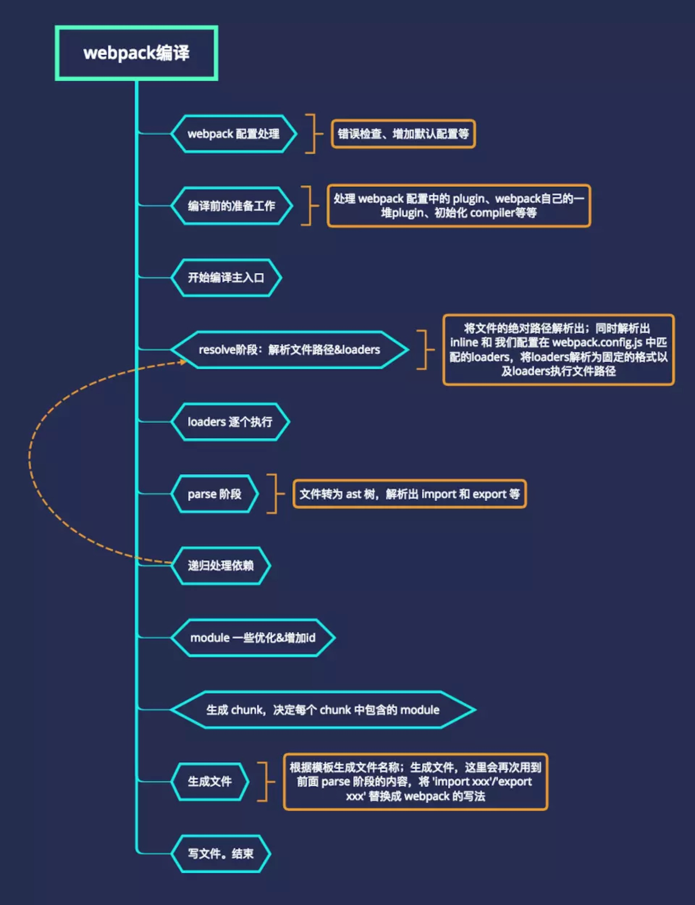

# webpack 的打包机制

webpack 从启动到结束会依次执行以下流程：

1. 初始化参数：读取命令行传入或者`webpack.config.js`文件，初始化本次构建的配置参数，生成 `Compiler` 实例
2. 开始编译: 用上一步得到的参数初始 `Compiler` 对象，加载所有配置的插件，为 webpack 事件流挂上自定义 hooks，通过执行对象的 `run` 方法开始执行编译
3. 确定入口：根据配置中的 `Entry` 找出所有入口文件
4. 解析文件：调用所有配置的 `Loader` 对模块进行编译，再找出该模块依赖的模块，再递归本步骤直到所有入口依赖的文件都经过了本步骤的处理
5. 生成依赖图谱：在经过第 4 步使用 `Loader` 翻译完所有模块后,得到了每个模块被翻译后的最终内容以及它们之间的依赖关系。
6. 输出资源：根据入口和模块之间的依赖关系，组装成一个个包含多个模块的 `Chunk`，再将每个 `Chunk` 转换成一个单独的文件加入输出列表中，这是可以修改输出内容的最后机会
7. 生成打包文件：在确定好输出内容后，根据配置确定输出的路径和文件名，将文件的内容写入文件系统中。



我们来看看 webpack 的源码

```js
function webpack(options, callback) {
    // 设置options的默认值，如output.path的默认值为process.cwd()，target的默认值为web
    new WebpackOptionsDefaulter().process(options);

    compiler = new Compiler();
    // 指定上下文context
    compiler.context = options.context;
    compiler.options = options;
    // 注册nodeEveironmentPlugin插件，触发‘before-run’时执行
    new NodeEnvironmentPlugin().apply(compiler);
    if(options.plugins && Array.isArray(options.plugins)) {
        // 注册配置文件中的所有插件
        compiler.apply.apply(compiler, options.plugins);
    }
    // 触发environment和after-environment事件
    compiler.applyPlugins("environment");
    compiler.applyPlugins("after-environment");
    // 处理参数，例如为不同的target注册插件，为externals配置注册ExternalsPlugin，为不同的devtool注册对应的插件,如果cache为true就注册CachePlugin等
    compiler.options = new WebpackOptionsApply().process(options, compiler);

    // 如果有callback就会直接调用compiler.run(callback)
    if(callback) {
        if(options.watch === true || (Array.isArray(options) && options.some(o => o.watch))) {
            const watchOptions = Array.isArray(options) ? options.map(o => o.watchOptions || {}) : (options.watchOptions || {});
            return compiler.watch(watchOptions, callback);
        }
        compiler.run(callback);
    }
    return compiler;
}
exports = module.exports = webpack;

// 导出各种插件,这样我们就可以直接使用插件：new webpack.DefinePlugin()
exportPlugins(exports, {
    "DefinePlugin": () => require("./DefinePlugin"),
    "NormalModuleReplacementPlugin": () => require("./NormalModuleReplacementPlugin"),
    ...
});
```

这里主要做了几件事情：

- 设置配置参数的默认值。
- new 一个 Compiler 实例。
- 调用实例方法 compiler.apply(plugins) 或 plugin.apply(compiler) 注册插件，比如将 nodeEveironmentPlugin 插件注册在 before-run 阶段。
- 调用 compiler.applyPlugins() 触发插件执行，比如 compiler.applyPlugins(‘before-run’)，就会通知注册在 before-run 这个阶段的插件执行。
- 最后导出 webPack，以及 webPack 官方提供的一些插件。

### ES6 转化为 ES5 的原理

- 解析：解析代码字符串，生成 AST；
- 转换：按一定的规则转换、修改 AST；
- 生成：将修改后的 AST 转换成普通代码。

### 参考文献

[webpack打包原理 ? 看完这篇你就懂了 !](https://juejin.cn/post/6844904038543130637)  
[手写webpack核心原理，再也不怕面试官问我webpack原理](https://juejin.cn/post/6854573217336541192)  
