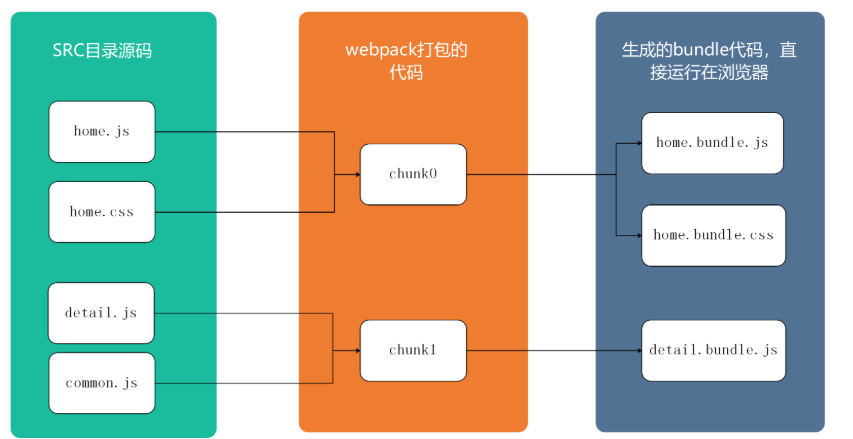

# 文件指纹 hash

⽂件哈希值就是打包后输出的⽂件名的后缀。浏览器为了优化体验，会有缓存机制。如果浏览器判断当前资源没有更新，就不会去服务端下载，而是直接使用本地资源。在 webpack 的构建中，我们通常使用给文件添加 hash 值来改名以及提取公共代码到不会改变的 lib 包中来解决新资源缓存问题。

### hash 的类型

- Hash：和整个项⽬的构建相关，只要项⽬⽂件有修改，整个项⽬构建的 hash 值就会更改
- Chunkhash：和 webpack 打包的 chunk 有关，不同的 entry 会⽣成不同的 chunkhash 值
- Contenthash：根据⽂件内容来定义 hash ，⽂件内容不变，则 contenthash 不变

### JS 使用 chunkhash

跟打包的chunk有关，具体来说webpack是根据入口entry配置文件来分析其依赖项并由此来构建该entry的chunk，并生成对应的hash值。不同的chunk会有不同的hash值。 

设置 output 的 filename，使⽤ [chunkhash]

```js
output: {
  filename: '[name][chunkhash:8].js',
  path: __dirname + '/dist'
}
```

**注意: chunkhash 无法和热更新一起使用。** 

在生产环境中，我们会把第三方或者公用类库进行单独打包，所以不改动公共库的代码，该chunk的hash就不会变，可以合理的使用浏览器缓存了。  

但是这个中hash的方法其实是存在问题的，生产环境中我们会用webpack的插件，将css代码打单独提取出来打包。这时候chunkhash的方式就不够灵活，因为只要同一个chunk里面的js修改后，css的chunk的hash也会跟随着改动。因此我们需要contenthash。


### CSS 使用 contenthash

contenthash表示由文件内容产生的hash值，内容不同产生的contenthash值也不一样。生产环境中，通常做法是把项目中css都抽离出对应的css文件来加以引用。  

对于webpack，旧版本而言，即便每次你npm run build，内容不做修改的话，contenthash值还是会有所改变。


设置 MiniCssExtractPlugin 的 filename，使⽤ [contenthash]

```js
const MiniCssExtractPlugin = require('mini-css-extract-plugin')
plugins: [
  new MiniCssExtractPlugin({
    filename: `[name][contenthash:8].css`,
  }),
]
```

如果想把 css 提取出来，那么 style-loader 就不能用了，因为两个是互斥的，所以我们可以这样写:

```js
module: {
  rules: [
    {
      test: /\.(le|c)ss$/,
      use: [
        {
          loader: MiniCssExtractPlugin.loader,
          options: {
            publicPath: '../'
          },
        },
        'css-loader',
        'postcss-loader',
        'less-loader',
      ]
    }
  ]
},
```

### 图片&字体 使用 hash

图片&字体文件哈希使⽤ [hash]，代码如下：

```js
module: {
  rules: [
     {
       test: /\.(png|svg|jpg|gif)$/,
       use: [{
          loader: 'file-loader’,
          options: {
             name: 'img/[name][hash:8].[ext] '
          }
       }]
     }
  ]
}
```

### Module、Chunk和Bundle

* module：我们写的源码，无论是commonjs还是amdjs，都可以理解为一个个的module
* chunk：当我们写的module源文件传到webpack进行打包时，webpack会根据文件引用关系生成chunk文件，webpack 会对这些chunk文件进行一些操作
* bundle：webpack处理好chunk文件后，最后会输出bundle文件，这个bundle文件包含了经过加载和编译的最终源文件，所以它可以直接在浏览器中运行。

我们通过下面一张图更深入的理解这三个概念：


