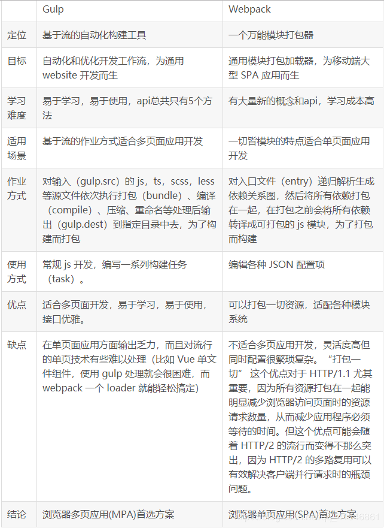

# webpack 与 glup

### glup

gulp 强调的是前端开发的工作流程，我们可以通过配置一系列的 task，定义 task 处理的事务（例如文件压缩合并、雪碧图、启动 server、版本控制等），然后定义执行顺序，来让 gulp 执行这些 task，从而构建项目的整个前端开发流程。

### webpack

webpack 是一个前端模块化方案，更侧重模块打包，我们可以把开发中的所有资源（图片、js 文件、css 文件等）都看成模块，通过 loader（加载器）和 plugins（插件）对资源进行处理，打包成符合生产环境部署的前端资源。

### 二者区别
1. 虽然都是前端自动化构建工具，但看他们的定位就知道不是对等的。
* gulp严格上讲，模块化不是他强调的东西，他旨在规范前端开发流程。
* webpack更是明显强调模块化开发，而那些文件压缩合并、预处理等功能，不过是他附带的功能。
2. gulp 走的是流式处理路线，webpack 走的是模块处理路线

### 总结
1. gulp应该与grunt比较，而webpack应该与browserify（网上太多资料就这么说，这么说是没有错，不过单单这样一句话并不能让人清晰明了）。

2. gulp是基于流的自动化构建工具，但不包括模块化的功能，如果要用到的话，就需要引入外部文件，比如require.js等；而webpack是自动化模块打包工具，本身就具有模块化，并且也具有压缩合并的功能。二者侧重点不同，我认为相互结合使用会提高代码质量和代码的优化。

3. gulp与webpack上是互补的，还是可替换的，取决于你项目的需求。如果只是个vue或react的单页应用，webpack也就够用；如果webpack某些功能使用起来麻烦甚至没有（雪碧图就没有），那就可以结合gulp一起用。

### webpack 对比 requirejs

1. webpack 在管理模块的时候不需要再封装一层像 requireJS 如下的东西

define(['jquery'], function(jquery){})

2. 它实现了前端代码模块化，提高了代码的复用性，从而提供公共模块的缓存功能。

- webpack 通过打包，不同页面单独加载自己的模块的 javascript 和 common javascript，而 requireJS 将所有的 javascript 文件打包成一个文件，使得一个站点中多个页面之间公用的 JS 模块无法缓存。
- webpack 引入了切分点（split point）与代码块（Chunk），切分点定义了所有依赖的模块，合起来就是一个代码块，从而实现一个页面引用一个代码块。
